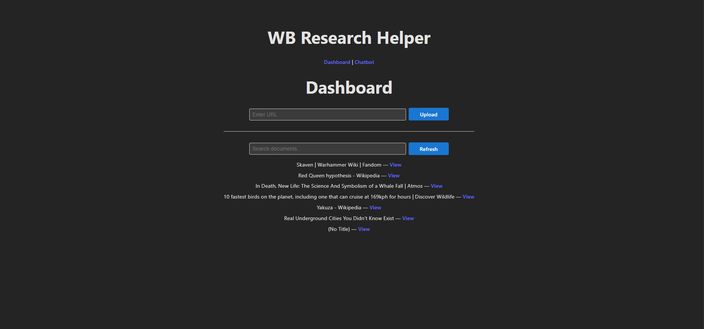
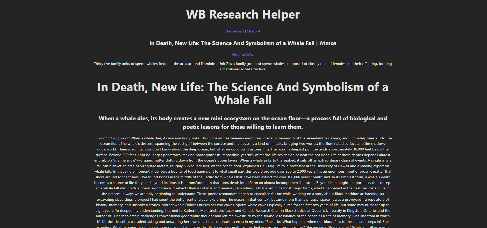
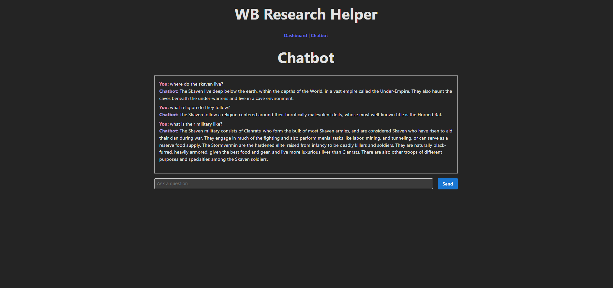

# Worldbuilding Research Helper

A local AI-powered research assistant designed to help worldbuilders collect, organise, and query information from websites such as Wikipedia, fandom wikis, and lore databases.

Instead of manually bookmarking or tracking research notes, this tool automatically ingests web pages, converts them into structured knowledge, and allows users to query their research through a Retrieval-Augmented Generation (RAG) chatbot.

The system extracts content from URLs, stores it in a database, creates vector embeddings for semantic search, and retrieves relevant information when answering user questions.

---

# Key Features

• Ingest research from any URL  
• Automatic webpage crawling and markdown extraction  
• Chunking + embedding pipeline for semantic search  
• Vector search using pgvector  
• RAG chatbot for querying stored research  
• Document-level retrieval and summarisation  
• Reranking for higher answer precision  
• Local-first architecture

---

# Dashboard



# Document Page



# Chatbot



---

# Application Flow

```

User launches ResearchEngine.exe
↓
Launcher starts backend services (Docker)
↓
Browser opens automatically
↓
Frontend Web UI
↓
FastAPI Backend
↓
PostgreSQL Database
↓
PGVector similarity search

```

---

# System Architecture

```

Frontend (React)
↓
FastAPI Backend
↓
RAG Query Pipeline
↓
PostgreSQL + PGVector
↓
Embedding Model + LLM

```

---

# Project Structure

```

WBResearchHelper/
│
├── backend/
│   ├── docker-entrypoint.sh        
│   ├── Dockerfile
│   ├── requirements.txt                # for docker
│   └── app
│       ├── main.py                     # FastAPI app
│       ├── ingest/
│       │   ├── services
│       │   │   ├── crawler_service.py          # Crawl4AI integration
│       │   │   ├── chunker_service.py          # split markdown into chunks
│       │   │   └── embedding_service.py        # create embeddings of documents for RAG
│       │   ├── ingest_ pipeline.py             # chain services
│       │   ├── ingest_repositories.py          # insert md and embeddings to postgreSQL
│       │   └── schemas.py
│       │
│       ├── query/
│       │   ├── services
│       │   │   ├── answer_service.py           # uses chat_service in /llm
│       │   │   ├── embedding_service.py        # create embeddings of query for RAG
│       │   │   ├── rerank_service.py           # select top m chunks from n chunks after ranking based on similarity score
│       │   │   └── retrieval_service.py        # query similar chunks from db
│       │   │
│       │   ├── query_pipeline.py               # chain services
│       │   ├── query_repositories.py           # insert md and embeddings to postgreSQL
│       │   └── schemas.py
│       │
│       ├── llm/
│       │   └── chat_service.py                 # RAG chat logic
│       │
│       ├── db/
│       │   ├── database.py                     # SQLite connection, async
│       │   └── models.py                       # SQLAlchemy models (documents, metadata)
│       │
│       ├── config/
│       │   └── config.py                       # backend settings and parameters
│       │
│       ├── utils/
│       │   └── logger.py
│       │
│       ├── schemas/
│       │   └── ingest.py
│       │
│       └── routes/
│           ├── documents.py
│           ├── health.py
│           ├── ingest.py
│           └── querychat.py
│
├── frontend/
│   ├── index.html                  # dashboard / URL submission
│   ├── chat.html                   # chat interface
│   │
│   ├── js/
│   │   ├── api.js                  # API wrapper
│   │   ├── injest.js
│   │   ├── documents.js
│   │   └── querychat.js
│   │
│   ├── css/
│   │   └── styles.css
│   │
│   └── wb-frontend/                    # React
│       ├── index.html
│       └── src/
│           ├── App.css
│           ├── App.jsx
│           ├── index.css
│           ├── main.jsx
│           ├── api/
│           │   └── api.js
│           │
│           ├── components/
│           │   ├── DocumentList.jsx
│           │   ├── InjestURL.jsx
│           │   └── QueryChat.jsx
│           │
│           └── pages/
│               ├── ChatPage.jsx
│               ├── Dashboard.jsx
│               └── DocumentPage.jsx
│
├── database/
│   └── wbresearch.db               # PostgreSQL DB
│
├── db-init/
│   └── 01-init.sql                 # add vector extension to DB before creating tables          
│
├── docker-compose.yml              # easier to run pgvector in docker container than manually installing
├── requirements.txt
└── README.md

```

---

# Technology Stack

| Layer | Technology |
|------|-------------|
| Backend API | FastAPI |
| Database | PostgreSQL |
| Vector Search | PGVector |
| Crawling | Crawl4AI |
| Embeddings | Sentence Transformers |
| LLM | OpenAI / Local Models |
| Frontend | React |
| Containerization | Docker |
| ORM | SQLAlchemy (Async) |

---

# Setup

## Backend Environment

Create a Python virtual environment:

```

py -3.12 -m venv wbrh_b_venv

```

Activate environment:

```

wbrh_b_venv\Scripts\Activate.ps1

```

Install dependencies:

```

pip install -r requirements.txt

```

---

## Start Services

Run containers:

```

docker-compose up

```

On first run:

• PostgreSQL container initializes  
• `wbresearch_db` database is created  
• pgvector extension is enabled  
• FastAPI connects using credentials from `.env`

Database data persists through Docker volumes.

To rebuild containers after code changes:

```

docker-compose up --build

```

Useful Docker cleanup commands:

```

docker system df
docker compose down
docker volume prune -a
docker image prune -a
docker builder prune -a

```

---

# Ingestion Pipeline

When a user submits a URL, the system performs the following steps:

```

URL
↓
Web Crawl
↓
Markdown Extraction
↓
Database Storage
↓
Text Chunking
↓
Embedding Generation
↓
Vector Storage

```

---

## 1. Crawl Webpage

The crawler extracts:

• page metadata  
• markdown content  

Library used:

[Crawl4AI](https://docs.crawl4ai.com)

---

## 2. Store Document

Documents are stored in PostgreSQL.

Table: `wb_research_documents`

```

id
url
title
markdown_content
created_at

```

Each document may contain multiple text chunks.

---

## 3. Chunk Text

Markdown content is split into chunks using:

• sentence boundaries  
• character limits  
• overlapping windows

Typical configuration:

```

Chunk size: 300–500 tokens
Overlap: 50–100 tokens

```

---

## 4. Generate Embeddings

Embeddings are created using **Sentence Transformers**.

Model:

```

all-MiniLM-L6-v2

```

Vector size:

```

384

```

Embeddings are stored in PostgreSQL using pgvector.

---

## 5. Vector Indexing

Chunks are indexed using **HNSW** for efficient similarity search.

Table: `document_chunks`

```

id
document_id
chunk_index
chunk_text
embedding (vector)

```

---

# Chatbot (RAG System)

The chatbot uses Retrieval-Augmented Generation.

Pipeline:

```

User Query
↓
Query Embedding
↓
Vector Search
↓
Reranking
↓
Context Assembly
↓
LLM Response

```

---

## Retrieval Process

1. Embed user query  
2. Retrieve top-k similar chunks  
3. Rerank results for precision  
4. Send context to LLM  

Example prompt:

```

System:
You are a research assistant. Use the provided context.

Context: <retrieved chunks>

User:
Any research on fossil fuels?

```

---

# RAG Enhancements Implemented

### Reranking

Vector search retrieves a broader set of candidates.

```

Vector search: top 20
Reranker selects: top 5

```

Reranker model:

```

cross-encoder/ms-marco-MiniLM-L-6-v2

```

This improves precision by evaluating query–chunk relevance directly.

---

# Planned Improvements

Future improvements to the system include:

### Retrieval

• Hybrid search (BM25 + vector search)  
• Query rewriting  
• Multi-query retrieval  
• Parent document retrieval  

### Accuracy

• Context compression  
• Answer verification pass  
• Improved citation generation  

### Advanced RAG

• Multi-step agentic retrieval  
• Knowledge graph integration  
• Self-query filtering using metadata  

### Content Sources

• YouTube transcript ingestion  
• Video context processing  

### UX

• Streaming responses  
• Conversation memory  

---

# Future Architecture (Event Driven)

For large-scale ingestion, the pipeline could move to an asynchronous architecture.

```

User submits URL
↓
API stores job
↓
Message Queue
↓
Worker processes crawl + embeddings
↓
Store results
↓
Notify user

```

Potential technologies:

• Redis / RabbitMQ  
• Celery workers  

---

# Frontend Development

The frontend is built with **React + Vite**.

Setup:

```

cd frontend
npm create vite@latest wb-frontend -- --template react
cd wb-frontend

npm install
npm install axios
npm install react-router-dom
npm install react-markdown remark-gfm

```

Run development server:

```

npm run dev

```

---

# References

- https://docs.crawl4ai.com  
- https://huggingface.co/sentence-transformers  
- https://www.youtube.com/watch?v=j1QcPSLj7u0  
- https://www.youtube.com/watch?v=TY_LiTrad3c  
- https://www.youtube.com/watch?v=FDBnyJu_Ndg  
- https://www.youtube.com/watch?v=DvURiNIvhxA